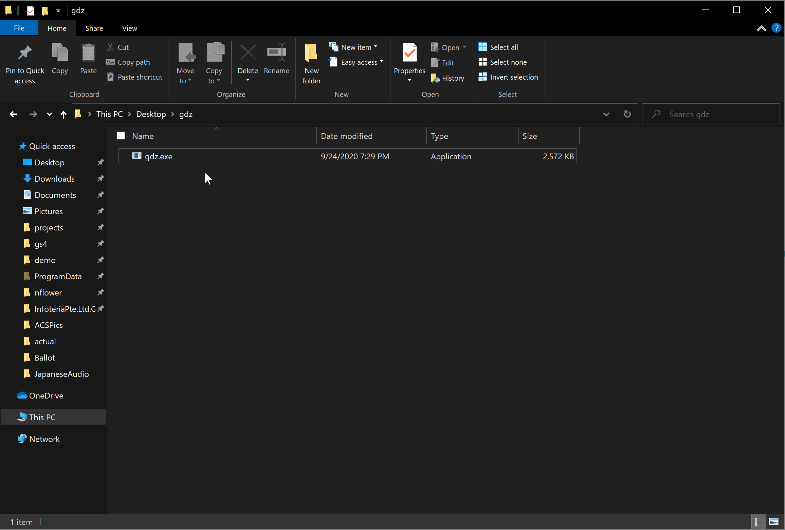

# GDZ - Gravio Diagnostics Zipper
Creates zip files used for dianosing Gravio Hubkit problems



# Usgae
GUI:
Just double click the .exe file  
  
Command Line:
```powershell
PS C:\Users\nflower\go\src\github.com\0xNF\gdz> .\gdz.exe
Finished creating Gravio Diagnostics Zip File. This file can be found at GravioDiagnostics_windows_4.0_1600943385089.zip
Finished creating Gravio Diagnostics Zip File. This file can be found at GravioDiagnostics_windows_3.8_1600943385173.zip
```

it will create one zip file for each installatin of Gravio Hubkit found. By default it will only search for `3.8`.


